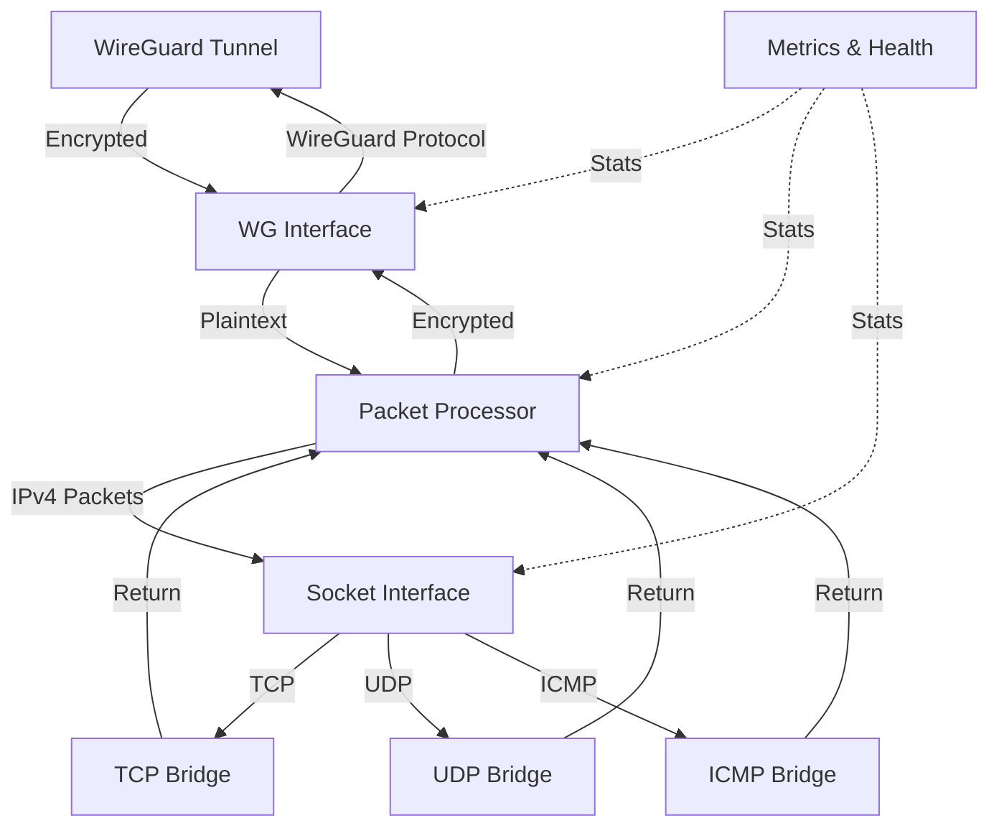

[](https://github.com/irctrakz/wgslirp/actions/workflows/docker.yml)
[](https://github.com/irctrakz/wgslirp/actions/workflows/go.yml)

# Userspace WireGuard slirp Router

A userspace WireGuard router that forwards decrypted IPv4 TCP/UDP through ordinary sockets (slirp-style), with no kernel TUN or elevated application privileges. Optional library ICMP has separate platform and permission requirements.

## Table of Contents

- [Overview](#overview)
- [Architecture](#architecture)
- [Installation](#installation)
  - [Using Docker](#using-docker)
  - [Building from Source](#building-from-source)
- [Quick Start](#quick-start)
- [Configuration](#configuration)
  - [WireGuard Configuration](#wireguard-configuration)
  - [System Configuration](#system-configuration)
- [Usage Examples](#usage-examples)
- [Troubleshooting](#troubleshooting)
- [License](#license)
- [Acknowledgments](#acknowledgments)

## Overview

This router combines WireGuard VPN with a userspace networking implementation to provide efficient, secure, container-friendly TCP/UDP forwarding. Library consumers can also select ICMP mode: echo uses raw sockets when available, or Linux ping sockets when allowed by `net.ipv4.ping_group_range`. See [ICMP privileges and activation](#icmp-privileges) for the distinction from the executable's TCP/UDP-only mode.

### Key Features

- **WireGuard Integration**: Secure, modern VPN tunneling with WireGuard protocol
- **User-space Networking**: TCP/UDP bridges implemented in userspace
- **Protocol Support**: Executable TCP/UDP forwarding; optional library ICMP mode
- **Performance Monitoring**: Built-in metrics collection and reporting
- **Health Checking**: Integrated health checks for monitoring system status
- **Container Ready**: Designed to run in containerized environments
- **Configurable**: Extensive configuration options via environment variables

## Architecture

The router consists of several key components:

1. **WireGuard Interface**: Handles encrypted tunnel traffic using the WireGuard protocol
2. **Socket Interface**: Manages TCP/UDP bridges for network traffic translation
3. **Slirp Bridges**: Direct inline delivery between slirp bridges and the processor (No FlowManager or egress limiter — simpler, predictable pipeline).
4. **Metrics Reporter**: Collects and reports performance metrics

The system uses a packet processing pipeline to efficiently route traffic between WireGuard tunnels and the host network.



## Installation

### Using Docker

Use the [bounded non-root deployment guide](DEPLOYMENT.md) and versioned
[Compose configuration](../deploy/compose.yaml). They use a validated image digest,
private env file, dropped capabilities, read-only root and finite CPU/memory/PID
limits. The validated development profile is Linux/amd64 TCP/UDP.

### Building from Source 
#### Container is at ghcr.io/irctrakz/wgslirp:latest

To build from source:

```bash
# Clone the repository
git clone https://github.com/irctrakz/wgslirp.git
cd wgslirp

# Build the binary
go build -o wgslirp ./cmd/wgslirp

# Or build the Docker image
docker build -t wgslirp -f Dockerfile .
```

## Quick Start

Get up and running quickly with these steps:

1. **Generate WireGuard Keys**:
   ```bash
   umask 077
   # Generate private key
   wg genkey > private.key
   
   # Generate public key from private key
   cat private.key | wg pubkey > public.key
   
   # Share only the public key
   echo "Public key: $(cat public.key)"
   ```

2. **Start the Router**:
   Follow [deployment setup](DEPLOYMENT.md) to create the private env file and
   select a validated digest, then run `docker compose -f deploy/compose.yaml up -d`.

3. **Configure Client**:
   Create a WireGuard client configuration:
   ```ini
   [Interface]
   PrivateKey = <client-private-key>
   Address = 10.77.0.2/32
   DNS = 8.8.8.8
   MTU = 1200
   
   [Peer]
   PublicKey = <your-public-key>
   Endpoint = <your-server-ip>:51820
   AllowedIPs = 0.0.0.0/0
   PersistentKeepalive = 25
   ```

4. **Verify Connection**:
   ```bash
   # Check router logs
   docker logs wgslirp
   
   # From the connected full-tunnel client, make a bounded TCP request
   curl --max-time 10 https://example.com
   ```

  Note: The executable currently forwards TCP/UDP only, so use a TCP or UDP
  connection to check forwarding. Guest ping requires the library's explicit
  [ICMP mode](#icmp-privileges).

## Configuration

The router loads and validates one environment snapshot before startup. See the [configuration contract and migration guide](CONFIGURATION.md) for precedence, compatibility adapters and legacy JSON/YAML deprecation. Set `PRINT_CONFIG=true` for a sanitized effective-settings summary.

### WireGuard Configuration

| Environment Variable | Description | Default |
|----------------------|-------------|---------|
| `WG_PRIVATE_KEY` | Base64-encoded WireGuard private key (required) | - |
| `WG_LISTEN_PORT` | UDP port for WireGuard to listen on | 51820 |
| `WG_PEERS` | Optional explicit peer selection (e.g., 0,1); empty selects none | Discover from `WG_PEER_<index>_*` settings when absent |
| `WG_OVERLAY_ROUTING` | Enable overlay routing mode (1/true/yes/on) | - |
| `WG_OVERLAY_EXCLUDE_CIDRS` | Comma-separated CIDRs to exclude from overlay routing | - |

### System Configuration

| Environment Variable | Description | Default |
|----------------------|-------------|---------|
| `DEBUG` | Enable debug logging (1/true/yes/on) | - |
| `METRICS_LOG` | Enable metrics logging | - |
| `METRICS_INTERVAL` | Interval for metrics reporting | 30s |
| `METRICS_FORMAT` | Format for metrics output (text/json) | text |
| `HEALTHCHECK` | Enable health checking | - |

### Environment Variables (reference)

Core WireGuard (required/primary)

- `WG_PRIVATE_KEY`: Base64 private key for the device (required).
- `WG_LISTEN_PORT`: UDP listen port, default 51820.
- `WG_MTU`: Plaintext MTU for the userspace TUN (default 1380).
- Peers are discovered from `WG_PEER_<index>_*` settings when `WG_PEERS` is absent.
  Indices are canonical nonnegative decimal integers (`0`, `2`, `10`); gaps are
  allowed and discovery uses numeric order. Incomplete peers and unknown peer
  setting names fail startup. Set `WG_PEERS` explicitly to select/reorder peers
  using the existing behavior; an explicit empty value selects none. For each index `i`:
  - `WG_PEER_i_PUBLIC_KEY`: base64 peer public key (required for each peer).
  - `WG_PEER_i_ALLOWED_IPS`: comma-separated CIDRs for overlay routing decisions.
  - `WG_PEER_i_ENDPOINT`: `host:port` (optional if static endpoint is used).
  - `WG_PEER_i_KEEPALIVE`: seconds (optional; typical 25).

Overlay routing (optional)

- `WG_OVERLAY_ROUTING`: enable overlay re-route for packets destined to AllowedIPs.
- `WG_OVERLAY_EXCLUDE_CIDRS`: CIDRs that should always egress via slirp.
- `WG_DISABLE_IPV6`: defaults to false and leaves namespace sysctls unchanged. Explicit true preserves the legacy best-effort IPv6-disable writes; failures remain nonfatal. Deployments relying on the old default must opt in or manage namespace policy externally; see [migration notes](CONFIGURATION.md#validation-and-migration). This setting does not enable IPv6 forwarding.

Logging and diagnostics

- `DEBUG`: enable verbose logging. Explicit packet ownership is unchanged; only legacy packet APIs retain debug-dependent copies.
- `WG_DEBUG`: verbose wireguard-go logging (chatty).
- `WG_PCAP`: file path to write plaintext IPv4 frames (DLT_RAW) captured by the userspace TUN.
- `WG_PCAP_MAX_BYTES`: capture file size limit, including headers; defaults to 67108864 (64 MiB). Must be an integer of at least 24. Capture stops before a complete record would exceed the limit and stays stopped until process restart. Invalid values fail startup without touching the file; capture is opened at startup and cannot follow later environment changes. Forwarding continues when capture stops. Capture files use private permissions (0600).

Metrics and health

- `METRICS_LOG`: `true` enables periodic metrics logging; `false` disables it even if an interval is set.
- `METRICS_INTERVAL`: duration like `15s` (default `30s`).
- `METRICS_FORMAT`: `text` (default) or `json`.
- `HEALTHCHECK`: `true` enables one-time startup probes. These log results; they are not continuous readiness monitoring. Probes have five-second operation timeouts and are canceled and joined during shutdown.
- `HEALTH_HTTP_URL`: URL for the host-stack HTTP probe (default `https://httpbin.org/ip`). The final response must have a 2xx status.
- `HEALTH_DNS_NAME`: name for both host resolver and slirp DNS probes (default `example.com`).
- `HEALTH_DNS_IP`: IPv4 DNS server for the slirp probe (default `1.1.1.1`). Success requires a complete response from the expected server to the probe's address/port, matching transaction ID and question, successful DNS status, and an A answer for `HEALTH_DNS_NAME` (including CNAME chains).

Socket lifecycle

Socket interfaces are single-use: configure the packet processor before `Start`, then call `Stop` to close connections and join accepted work. Repeated or concurrent `Stop` calls are safe; restart and writes after shutdown return errors. Processor replacement after startup is ignored with a warning. Create a new interface to change the processor or restart. Delivery callbacks must return promptly; shutdown waits for in-flight callbacks to complete. Use `RequestStop` inside callbacks and `StopContext` to bound a caller's wait. See [lifecycle and callback contracts](LIFECYCLE.md) for ownership, re-entry restrictions and shutdown limits. TCP FIN recovery preserves both half-close directions and retries unacknowledged FINs; see the same document for progress-based close expiry and TIME-WAIT slot retention.

Packet processing and TUN (userspace)

Guest IPv4 datagrams are validated before forwarding: header and total lengths must be consistent, TCP header offsets must fit, and UDP length must match the IP payload. Bytes beyond the declared IP length are ignored as padding. Incoming fragments use [bounded TCP/UDP/ICMP reassembly](IPV4_FRAGMENT_REASSEMBLY.md) by default; explicit `IPV4_REASSEMBLY=false` preserves rejection. Zero-value library configuration also stays disabled. Configure guest MTU to avoid unnecessary fragmentation. Fragmentation of synthesized host-to-guest UDP replies remains supported. IPv4, TCP and ICMP checksums and nonzero UDP checksums are verified; IPv4 UDP checksum omission remains accepted. All IPv4 options are rejected. Malformed packets return `socket.ErrMalformedPacket`; checksum failures also match `socket.ErrInvalidChecksum`. Unsupported fragments/options match `socket.ErrUnsupportedFragment` / `socket.ErrUnsupportedIPOptions`, available through `errors.Is`. See [packet validation policy](PACKET_VALIDATION.md) for compatibility, offload requirements and TCP sequence-wrap limits.

- `PROCESSOR_WORKERS`: inactive in the executable; warns at startup. Library processor only: default 4, range 1-256.
- `PROCESSOR_QUEUE_CAP`: inactive in the executable; warns at startup. Library processor only: default 1000, range 1-65536.
- `WG_TUN_QUEUE_CAP`: capacity of the WGTun outbound queue to wireguard-go (default 1024, range 1-65536).
- `POOLING`: bounded packet pooling defaults on; set false/0/off to use exact-sized storage.

TCP slirp (userspace)

Resource controls are parsed once before socket startup. Invalid, empty, negative, or overflowing numeric values fail startup. The following environment settings override application defaults:

| Setting | Default | Meaning |
|---|---:|---|
| `TCP_FLOW_LIFETIME_SEC` | 120 | Idle TCP lifetime; zero uses the default. |
| `UDP_FLOW_LIFETIME_SEC` | 60 | Idle UDP lifetime; zero uses the default. |
| `TCP_REASSEMBLY_CAP_BYTES` | 131072 | Out-of-order storage threshold per TCP flow; zero uses the default. |
| `IPV4_REASSEMBLY` | true | Bounded incoming TCP/UDP/ICMP fragment reassembly; explicit false disables it. See [limits and acceptance gates](IPV4_FRAGMENT_REASSEMBLY.md). |
| `IPV4_FRAGMENT_BUFFER_CAP_BYTES` | 4194304 | Finite fragment storage cap sharing the socket budget; zero uses the default. Fixed datagram/source/range quotas also apply. |
| `MAX_TCP_FLOWS` | 256 | Maximum registered TCP flows, including TIME-WAIT; explicit zero is unlimited. |
| `MAX_UDP_FLOWS` | 512 | Maximum registered UDP flows; explicit zero is unlimited. |
| `MAX_PENDING_TCP_DIALS` | 64 | Concurrent fast/async TCP dial attempts; one reservation spans fallback. |
| `SOCKET_BUFFER_CAP_BYTES` | 67108864 | Shared TCP/UDP and downstream queue buffer budget (64 MiB). |
| `TCP_PEND_CAP_BYTES` | 65536 | Per-flow TCP data accepted before host connection completes. |
| `TCP_RETRANSMIT_CAP_BYTES` | 1048576 | Per-flow unacknowledged TCP payload storage (1 MiB). |

`TCP_ACK_DELAY_MS` defaults to 10; zero requests immediate ACK scheduling. Go callers should use `socket.DefaultConfig()` for defaults and set fields explicitly. The TCP bridge honors these typed fields; it no longer reads `TCP_ACK_DELAY_MS` or `TCP_PEND_CAP_BYTES` directly from the environment. Expiry is checked periodically, so removal can occur after the configured idle lifetime.

#### TCP and packet-header configuration

The executable parses the following controls once before creating network resources.
Explicit environment values override `socket.DefaultConfig()`; invalid or empty
values now stop startup with the setting name instead of silently selecting a
fallback. Booleans accept true/false, 1/0, yes/no and on/off (case-insensitive).

| Setting | Default | Meaning |
|---|---:|---|
| `TCP_ACK_IDLE_GATE_MS` | 6000 | Gate host reads after this long without ACK/window progress; zero disables gating and ACK-idle failure. |
| `TCP_ACK_IDLE_MIN_INFLIGHT` | 0 | Minimum bytes in flight for gating; zero uses one MSS. |
| `TCP_ACK_IDLE_FAIL_SEC` | 120 | Reset an ACK-stalled flow after this interval; zero disables this check. |
| `TCP_ACK_TRACE` | false | Log ACK classification. |
| `TCP_MSS_CLAMP` | 0 | Advertised/segmentation MSS ceiling, up to 65535; zero leaves peer/MTU limits. |
| `TCP_PACE_US` | 0 | Inter-segment pacing in microseconds; zero disables. |
| `TCP_ERROR_SIGNAL` | icmp | Dial-failure signaling: `icmp`, `rst`, or `none`. |
| `TCP_LOG_HANDSHAKE` | false | Log SYN-ACK MSS decisions. |
| `TCP_FAST_DIAL_MS` | 5 | Wait for an immediate dial result before SYN-ACK; zero retains the historical 1 ms minimum. The same dial continues asynchronously, with a total deadline of the greater of this wait and 5 seconds. |
| `TCP_CC` | newreno | Congestion control: `newreno` (`reno`/`new-reno` aliases) or `off`. |
| `TCP_INIT_CWND_MSS` | 0 | Positive values reduce the RFC 6928 initial window to at most this many MSS; zero uses the RFC default. |
| `TCP_SOCK_RCVBUF` | 0 | Requested host receive-buffer bytes; zero uses OS defaults. |
| `TCP_SOCK_SNDBUF` | 0 | Requested host send-buffer bytes; zero uses OS defaults. |
| `TCP_WS_OUT` | 7 | Preferred TCP window scale, 0-14, negotiated only when offered. Receive space stays bounded by `TCP_REASSEMBLY_CAP_BYTES`; small caps lower the scale. See [receive recovery](TCP_RECEIVE_RECOVERY.md). |
| `TCP_ENABLE_SACK` | false | Legacy force-SACK option; peer-offered SACK is still honored when false. |
| `COPY_TOS` | false | Preserve guest DSCP/ECN in supported synthesized reply paths. |
| `IP_TTL` | 64 | Synthesized reply TTL, 1-255. |

Socket buffers now apply to both fast and asynchronous dials. The OS can clamp
requested sizes; setter failures are logged and retain the OS behavior. Zero
ACK-idle failure now explicitly disables that check; the separate connection
health monitor and flow expiry still apply. Invalid TTLs no longer silently use 64.

Go callers configure `Config.Transport` using `DefaultTransportConfig()` (a nil
pointer retains defaults). `NewSocketInterface` copies this value, so later
changes to the caller's template or environment cannot change the interface.
Library constructors no longer implicitly read the TCP/header variables above;
call `socket.ConfigFromEnv(base, os.LookupEnv)` explicitly to opt into environment
overrides and validate the result. Existing explicit MTU/MSS/pacing runtime APIs
remain available. WireGuard/capture settings and process-wide pooling policy also use validated startup configuration; see [CONFIGURATION.md](CONFIGURATION.md).

Flow-cap migration: previously, unset flow caps were unlimited, then bounded at 64 TCP and 256 UDP. The application and `socket.DefaultConfig()` now default to 256 TCP and 512 UDP flows. Explicit positive overrides remain authoritative; explicitly set `MAX_TCP_FLOWS=0` / `MAX_UDP_FLOWS=0` to retain unlimited flow admission. Explicit zero fields in manually constructed Go configs keep their previous meaning. Dial and buffer budgets still apply independently. See [resource-budget measurements](RESOURCE_BUDGETS.md) for historical measurements and the current policy.

The four new dial/buffer controls use their finite defaults when zero; zero never disables these limits. In particular, `TCP_PEND_CAP_BYTES=0` now means 64 KiB rather than unlimited buffering. Defaults are supported by the finite mixed TCP/UDP bridge workload in [RESOURCE_BUDGETS.md](RESOURCE_BUDGETS.md); F10 also covers bounded encrypted loopback round trips and TCP churn/expiry. A finite low-rate encrypted memory profile passed natural-GC acceptance with injected loss/reordering; criteria and limits are in [ENCRYPTED_WORKLOADS.md](ENCRYPTED_WORKLOADS.md). Larger WAN/soak and release validation remain tracked in [RELEASE_VALIDATION.md](RELEASE_VALIDATION.md).

The shared buffer budget reserves capacity before allocating TCP pending, reassembly and retransmission payloads, asynchronous-dial ICMP quotes, TCP/UDP/raw-ICMP read buffers, synthesized TCP/UDP/ICMP packets, ICMP parser/marshal scratch and WireGuard-to-socket copies. Retained packet/queue entries also incur a 128-byte accounting allowance; reassembly merges reserve replacement storage while old data remains live. Each UDP flow requires a 65,535-byte read-buffer reservation. Raw ICMP startup fails if its 65,536-byte reader plus entry allowance cannot be reserved. Reservations release on ACK, flush, rejection, expiry or worker/flow teardown as appropriate.

WireGuard output and socket processor queues also share this budget when constructed with the socket writer. WireGuard reserves before copying and rejects a full queue before allocation. Processor entries charge the retained slice capacity (including unused capacity), and remain charged while a worker is writing. Reservations release after TUN reads (including undersized-read failures), worker completion, rejection or shutdown drain. An in-flight TUN read retains its reservation until that read returns. Processor admission transfers packet ownership only on success; callers retain rejected packets. The WireGuard processor consumes pooled input after synchronous capture/injection, including failed injection, and makes only the TUN's required queue copy.

Synthesized packets carry their reservation through downstream ownership; accepted pooled packets must eventually be released with `core.ReleasePacket`. UDP fragmentation reserves the full datagram and constructs one separately reserved fragment at a time; refusal drops the remaining datagram without allocating all its fragments. Socket writers borrow packets synchronously and must copy data they retain after returning. [Explicit packet constructors and accessors](PACKET_OWNERSHIP.md) provide explicit copying/borrowing, with no debug-dependent ownership behavior. See [retired API migration](API_MIGRATION.md). Custom packet implementations must expose retained slice storage through `Data` for accounting.

With `POOLING=1`, live synthesized buffers are charged at their full pool-class capacity. Idle buffers have a separate fixed process-wide ceiling of 960 KiB (32 buffers each of 2, 4, 8 and 16 KiB); excess returns are discarded and reused buffers are cleared before synthesis. Production synthesis always uses releasable packets; configurable wrapping and its legacy helper have been removed. Custom consumers that previously relied on garbage collection must release accepted pooled packets to return their reservations.

Existing constructors remain compatible. Custom writers can implement `socket.PacketBufferReserver` to supply a shared budget; otherwise each adapter receives its own finite 64 MiB budget. Accounted live packet storage is bounded by each shared budget, plus the fixed idle-pool allowance across the process. This is not a process RSS ceiling: kernel buffers, Go allocator/GC overhead, goroutine/flow metadata, caller-owned inputs, custom implementation storage and allocations made by external users of compatibility helpers remain outside it. Mixed loopback TCP/UDP workload measurements supplement reservation checks: reservations return to zero, while natural heap/RSS recovery varies with allocator caching. These short runs are not a long-duration or encrypted WireGuard throughput benchmark.

When dial admission is exhausted, new attempts receive RST and `socket.ErrDialLimit`. A new UDP flow without buffer capacity returns `socket.ErrBufferLimit` before sending its payload. TCP pending/reassembly rejection does not acknowledge unaccepted data, allowing retransmission. The per-flow retransmission cap pauses host reads until ACK progress; aggregate exhaustion while queuing a server reply resets only that flow. Active-flow admission remains `socket.ErrFlowLimit`. Errors can be checked with `errors.Is`.

Detailed metrics (`tcp_ext` in JSON output) include `dial_reserved`, `dial_peak`, `dial_limit`, `dial_refused`, `socket_buffer_bytes`, `socket_buffer_peak`, `socket_buffer_limit`, `socket_buffer_refused`, and `buffer_dropped`. Socket-buffer values cover TCP, UDP and adapters using that socket's packet buffer budget. Refusal counters count reservation attempts, including retries, rather than unique packets or flows; `buffer_dropped` counts rejected TCP queue operations/aborted buffered flows. Queue budget refusal returns `socket.ErrBufferLimit`; shared-budget refusals are classified by the `admission` counters documented in [OBSERVABILITY.md](OBSERVABILITY.md). Queue/error counting and compatibility contracts are documented there as part of completed F09.

- `TCP_ACK_DELAY_MS`: delayed ACK timer (ms). Lower (e.g., 5) reduces ACK latency.
- `TCP_ENABLE_SACK`: advertise SACK permitted in SYN-ACK (recommended 1 for modern stacks).
- `TCP_MSS_CLAMP`: clamp advertised MSS (bytes). Leave unset unless troubleshooting PMTUD.
- `TCP_PACE_US`: microseconds to sleep between host→guest segments (0 disables). Use only when packet bursts cause loss/ECN on marginal paths.
- `TCP_GATE_LOG` and `POOL_WRAP`: removed; startup requires deleting these settings, even when false/off. See [migration](API_MIGRATION.md).
- `TCP_CC`: congestion control algo for host→guest path; `off` to disable, default newreno.
- `TCP_ERROR_SIGNAL`: how to signal outbound connect failure to the guest: `icmp` (default), `rst`, or `none`.
- `TCP_FAST_DIAL_MS`: initial wait (ms) to map immediate refusals to ICMP/RST before SYN-ACK (default 5 ms). Expiry hands off the same dial rather than cancelling and redialing.
- `TCP_SOCK_RCVBUF`, `TCP_SOCK_SNDBUF`: optional OS socket buffer sizes for host TCP connections.
- `TCP_ACK_IDLE_GATE_MS`, `TCP_ACK_IDLE_MIN_INFLIGHT`, `TCP_ACK_IDLE_FAIL_SEC`: advanced gating of host reads when no guest ACK progress. Defaults: `TCP_ACK_IDLE_GATE_MS=6000`, `TCP_ACK_IDLE_FAIL_SEC=120`; `TCP_ACK_IDLE_MIN_INFLIGHT` defaults to ~1 MSS when unset.
  The sender and 15-second maintenance pass share this policy; the former hardcoded 30-second closure is removed. A zero failure timeout disables ACK-idle closure while retaining gating. The failure deadline takes effect only after the gate and minimum in-flight threshold are met. Independent connection-lifetime, retransmission and close timers still apply.

IP header synthesis

- `COPY_TOS`: truthy to copy DSCP/ECN from outbound to synthesized return packets.
- `IP_TTL`: override TTL for synthesized return packets (1–255; default 64).

Notes:
- Simple mode is always on: there is no FlowManager or egress limiter in the pipeline. Any legacy FLOW_* envs are ignored.
- `WG_TUN_ASYNC_WRITE` and related `WG_TUN_IN_*` knobs are ignored in simple mode.

### Performance Tuning (optional)

| Environment Variable | Description | Default |
|----------------------|-------------|---------|
| `POOLING` | Enable pooled buffers to reduce alloc/GC; false disables | on |
| `PROCESSOR_WORKERS` | Library-only workers; inactive in executable | 4 |
| `PROCESSOR_QUEUE_CAP` | Library-only queue; inactive in executable | 1000 |
| `WG_TUN_QUEUE_CAP` | WGTun out queue capacity toward wireguard-go | 1024 |
| `TCP_ACK_DELAY_MS` | Delayed ACK timer (milliseconds) | 10 |

### Simple Mode

The router now always operates in simple mode: inline delivery, no FlowManager, no egress limiter. `SIMPLE_MODE` is treated as on by default and may be removed in future releases.

<!-- Auto-Fallback removed -->

### Metrics Reporter

Metrics JSON includes `schema_version: 1`. See [observability contracts](OBSERVABILITY.md) for corrected frame/payload counting, reporter-local deltas, unavailable statistics and queue saturation semantics.

Enable periodic metrics logs for visibility. Text or JSON formats are supported. Set `METRICS_LOG=true` or a positive `METRICS_INTERVAL` to enable; explicit `METRICS_LOG=false` overrides the interval.

| Environment Variable | Description | Default |
|----------------------|-------------|---------|
| `METRICS_LOG` | Enable metrics logging | - |
| `METRICS_INTERVAL` | Interval for metrics reporting (e.g., `15s`) | 30s |
| `METRICS_FORMAT` | `text` or `json` | text |

Admission-failure counters are available in the JSON `admission` object and a text `admission:` line. See [counter definitions and troubleshooting](OBSERVABILITY.md) for counting units, protocol behavior and legacy overlap.

Selected counters (subset):
- Totals per bridge (packets/bytes/errors) and active flows.
- TCP extras: `rto`, `active_rto_flows`, `rto_delta`.
- Async dial/pending (tcp slirp): `dial_start`, `dial_ok`, `dial_fail`, `dial_inflight`, `pend_enq`, `pend_flush`, `pend_drop`.
- WG plaintext: `plaintext_from_wg`, `plaintext_to_wg`, `queue_drops`.


#### Enable metrics in the bounded deployment

Add `METRICS_LOG=true`, `METRICS_INTERVAL=15s` and `METRICS_FORMAT=json` to the
private env file described in [DEPLOYMENT.md](DEPLOYMENT.md). Keep the Compose
resource/security settings and size application limits using workload measurements.

### ICMP Privileges

The executable currently selects TCP/UDP-only mode; adding `CAP_NET_RAW` does
not enable guest ping in the executable. TCP/UDP forwarding needs neither raw
sockets nor kernel TUN access.

Library consumers can select `socket.Config.Protocol = "ip4:icmp"` (also the
library default). This mode tries a raw ICMP socket, then a datagram ping socket
on platforms that support it. Linux permits ping sockets when the process group
is allowed by `net.ipv4.ping_group_range`; this fallback supports echo
request/reply traffic only. Selecting ICMP mode fails startup if neither socket
is available. Explicit TCP/UDP-only mode starts without either socket and drops
guest ICMP. Broader host ICMP traffic requires a raw socket and its privileges; privileged raw-ICMP deployment is outside the [validated deployment profile](DEPLOYMENT.md#optional-icmp-scope).

The Linux ICMP datagram integration test exercises production startup, echo
identity restoration and concurrent shutdown. Run it inside an approved bounded
Linux test container with all capabilities dropped and a non-root user whose
group is already permitted by `net.ipv4.ping_group_range`:

```bash
WGSLIRP_REQUIRE_ICMP_DGRAM=1 go test -race -tags=integration -timeout=120s -count=1 -parallel=1 ./pkg/socket -run='^TestICMPDatagramIntegration_'
```

The environment flag makes unavailable ping sockets or an available raw socket
a test failure instead of a skip. The application never changes the ping-group
sysctl. Outstanding echo requests are capped at 1,024 per interface, expire
after five seconds, and participate in the shared socket buffer budget.

**Note**: To disable metrics, set `METRICS_LOG=false` or leave both `METRICS_LOG` and `METRICS_INTERVAL` unset. Empty values are invalid.

## Usage Examples

Use the [deployment guide](DEPLOYMENT.md) for one maintained Docker Compose
example, credentials, shutdown and optional ICMP scope. Do not add capabilities
or kernel TUN devices to enable TCP/UDP forwarding.

## Troubleshooting

### Common Issues

1. **Connection Failures**
   - Verify WireGuard keys are correctly formatted (base64-encoded)
   - Check that UDP port 51820 (or your configured port) is open in firewalls
   - Ensure peer endpoints are reachable

2. **Performance Issues**
   - Enable metrics logging to identify bottlenecks
   - Check for excessive connection counts or packet drops
   - Consider adjusting MTU settings if needed

3. **High CPU Usage**
   - This can be normal for high-throughput scenarios
   - Consider disabling debug mode in production

### Debugging

View logs with:

```bash
docker logs wgslirp
```

## License

This project is licensed under the Apache 2.0 - see the LICENSE file for details.

## Acknowledgments

- [WireGuard](https://www.wireguard.com/) for the secure VPN protocol
- All contributors to this project
