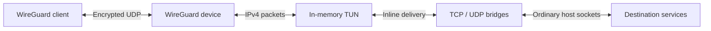

# wgslirp

[](https://github.com/irctrakz/wgslirp/actions/workflows/docker.yml)
[](https://github.com/irctrakz/wgslirp/actions/workflows/go.yml)

A userspace WireGuard router that forwards IPv4 TCP/UDP through ordinary host
sockets, slirp-style. The application runs without root, kernel TUN devices,
added capabilities or host forwarding/NAT rules. Outbound connections use the
server's network access and egress address.

The executable supports **IPv4 TCP/UDP**. It does not forward IPv6 or guest ping.
Incoming IPv4 fragment reassembly and bounded packet pooling are enabled by
default, with explicit opt-outs. See [ICMP scope](#icmp-privileges) for library users.

## Quick start

The maintained [Compose file](../deploy/compose.yaml) runs a non-root container
with all capabilities dropped, a read-only root, bounded logs and finite CPU,
memory and PID limits. Its 1 CPU / 256 MiB profile is a validated small-workload
baseline; size resources for your deployment using measurements.

Run these commands from the repository root on a Docker host. This Linux/amd64
development image passed encrypted forwarding, fragment handling and SIGTERM
under traffic, then was promoted **without rebuilding**:

```sh
export WGSLIRP_IMAGE=ghcr.io/irctrakz/wgslirp@sha256:be56bb216de910559d457e3b23dd7cf0b796f2577474bcbc503a2ee759973e1b
umask 077
```

Create `deploy/wgslirp.env` in a local editor, replacing the placeholders:

```dotenv
WG_PRIVATE_KEY=<server-private-key>
WG_PEER_0_PUBLIC_KEY=<client-public-key>
WG_PEER_0_ALLOWED_IPS=10.77.0.2/32
```

Keep the file private (mode 0600 on Linux); it is excluded from Git and the Docker
build context. Compose resolves `env_file` relative to `deploy/compose.yaml`.
The image variable selects the container image; the env file configures the
application. `WG_PEERS` is optional: peer indices are discovered automatically.
For another client, add matching `WG_PEER_1_*` fields and use a different address.

WireGuard clients can generate key pairs. If the `wg` tool is installed, generate
a server pair with `wg genkey > private.key` and
`wg pubkey < private.key > public.key` under the restrictive umask above.
Share only public keys. Docker administrators can inspect container environment
values; an env file is not a secret manager.

```sh
docker compose -f deploy/compose.yaml config --quiet
docker compose -f deploy/compose.yaml up -d
docker compose -f deploy/compose.yaml logs --tail 50 wg-router
```

Configure the client with its own key and the server's public key:

```ini
[Interface]
PrivateKey = <client-private-key>
Address = 10.77.0.2/32
DNS = 1.1.1.1
MTU = 1380

[Peer]
PublicKey = <server-public-key>
Endpoint = <server-address>:51820
AllowedIPs = 0.0.0.0/0
PersistentKeepalive = 25
```

Allow the published UDP port through the server's firewall. The example client
MTU matches the server default; if a path needs a smaller MTU, configure both
the client and `WG_MTU` accordingly. This client configuration routes IPv4 through
the tunnel; IPv6 policy needs separate client configuration.

Verify forwarding from the connected client with a bounded TCP request:

```sh
curl --max-time 10 https://example.com
```

Guest ping is not a forwarding test for this executable. To stop and remove the
container, run `docker compose -f deploy/compose.yaml down`.
See [deployment guidance](DEPLOYMENT.md) and [image acceptance evidence](API_MIGRATION.md#acceptance-at-4b2e254)
for runtime restrictions, credentials and validation details.

## Configuration

Startup parses and validates a single environment snapshot before opening
resources. Invalid supported values fail early with the setting name.
The executable has no JSON/YAML configuration-file or command-line override layer.

### Environment variables reference

The complete [environment reference](ENVIRONMENT.md) covers WireGuard peers,
logging, health probes, capture, queues and TCP controls. The
[configuration contract](CONFIGURATION.md) explains validation and library adapters.
Important defaults are:

| Setting | Default | Purpose |
|---|---:|---|
| `WG_LISTEN_PORT` | 51820 | WireGuard UDP listen port. |
| `WG_MTU` | 1380 | Plaintext tunnel MTU. |
| `MAX_TCP_FLOWS` | 256 | Registered TCP flows, including TIME-WAIT. |
| `MAX_UDP_FLOWS` | 512 | Registered UDP flows. |
| `MAX_PENDING_TCP_DIALS` | 64 | Concurrent outbound TCP dial attempts. |
| `WG_TUN_QUEUE_CAP` | 1024 | Packets queued toward WireGuard. |
| `SOCKET_BUFFER_CAP_BYTES` | 67108864 | Shared live buffer budget (64 MiB). |
| `IPV4_REASSEMBLY` | true | Bounded incoming fragment reassembly. |
| `POOLING` | true | Bounded synthesized-packet cache, including ACK/control packets. |

`IPV4_REASSEMBLY=false` and `POOLING=false` remain supported escape hatches.
Flow and buffer budgets are independent. Accounted storage is not a process RSS
ceiling; leave headroom for kernel buffers, Go runtime overhead and metadata.
Idle pool retention is capped at 960 KiB. See [resource budgets](RESOURCE_BUDGETS.md).

### Quiet operation and diagnostics

Default logging is quiet: `DEBUG=false`, `WG_DEBUG=false`, metrics disabled and
capture disabled. The Compose file bounds log retention. To preserve quiet logs
even with an inherited metrics interval, set `METRICS_LOG=false` explicitly.

For temporary diagnosis, add these settings to `deploy/wgslirp.env` and recreate
the container with `docker compose -f deploy/compose.yaml up -d`:

```dotenv
METRICS_LOG=true
METRICS_INTERVAL=60s
METRICS_FORMAT=json
```

Metrics include flow counts, queue pressure, admission refusals, buffer usage and
TCP recovery. Repeated known packet failures are aggregated by category.
Accepted packets above the configured MTU increment `packet_size.accepted_oversized`
and optionally log at debug level. Actual local size rejection reports its
specific cause; acceptance does not prove remote delivery.
See [observability](OBSERVABILITY.md) for counting units and actionable diagnostics.

`PRINT_CONFIG=true` emits a sanitized startup summary. `HEALTHCHECK=true` runs
one-time startup probes, not continuous readiness monitoring. `WG_PCAP` captures
plaintext traffic and needs a private writable path and finite size limit;
leave it unset for normal operation.

### Upgrading older deployments or Go callers

This development branch intentionally removed unsupported kernel-TUN constructors,
the legacy JSON/YAML configuration model, implicit/debug-dependent packet APIs
and optional packet wrapping. **Remove `POOL_WRAP` and `TCP_GATE_LOG`** from the
environment: their presence fails startup, including false/off values.

`DEBUG` affects logging only. `PROCESSOR_WORKERS` and `PROCESSOR_QUEUE_CAP` are
library-only and warn when set in the inline executable. Consult the
[API migration guide](API_MIGRATION.md) and [changelog](CHANGELOG.md) before upgrading.

## Architecture



The TCP bridge maintains guest TCP state while establishing host socket connections;
the UDP bridge maps guest flows to host sockets. Synthesized replies return through
the in-memory TUN and WireGuard encryption. Queues, pending dials, retained payloads
and fragment assemblies have finite budgets. Packet ownership and release are
explicit; shutdown cancels and joins accepted work.

IPv4 headers, lengths and checksums are validated before forwarding. Incoming
fragments have bounded reassembly, quotas and expiry; IPv4 options are rejected.
Host-to-guest UDP replies can be fragmented. See [packet validation](PACKET_VALIDATION.md),
[fragment reassembly](IPV4_FRAGMENT_REASSEMBLY.md), [ownership](PACKET_OWNERSHIP.md)
and [lifecycle contracts](LIFECYCLE.md).

### ICMP privileges

The executable selects TCP/UDP-only mode. Adding `CAP_NET_RAW` does not enable
guest ping. TCP failure signaling can still synthesize ICMP errors.

Go library consumers can select `socket.Config.Protocol = "ip4:icmp"` (the library
default). This tries raw ICMP, then echo-only ping sockets. Capability-free Linux
ping sockets require the process group to be permitted by the host's
`net.ipv4.ping_group_range`; the application never writes that policy. Startup
fails if neither socket is available. Privileged raw ICMP is outside the validated
container profile. See [optional ICMP deployment scope](DEPLOYMENT.md#optional-icmp-scope).

## Troubleshooting

| Symptom | Check / action |
|---|---|
| No tunnel traffic | Check keys, peer address, endpoint and published UDP port/firewall reachability. |
| Flow limit reached | Inspect TCP/UDP admission counters and active flows. TCP slots include four-minute TIME-WAIT; account for churn before increasing finite caps and container resources. |
| Buffer or fragment quota refusals | Inspect shared-buffer usage, reassembly counters and expiry recovery; raising flow caps alone does not raise these budgets. |
| MTU-related failures | Check client/server MTUs and the reported rejection reason. An accepted oversized-packet counter alone is not evidence of a drop. |
| Guest ping fails | Expected for the executable; verify forwarding with TCP or UDP. |
| Startup rejects a removed setting | Delete `POOL_WRAP` / `TCP_GATE_LOG`; follow the migration guide. |

Recovery activity is not itself a connection failure. Confirm loss, sustained
stalls or consequential refusal using [metrics and diagnostics](OBSERVABILITY.md)
before changing TCP pacing, MSS or congestion controls.

## Build and validation

Use Go 1.23.x (CI pins 1.23.12). From the repository root:

```sh
go build -o wgslirp ./cmd/wgslirp
go vet ./...
go test -timeout=120s ./...
```

Building and running TCP/UDP forwarding requires no elevated kernel privileges.
Linux is the full acceptance target; some integration and file-permission checks
are platform-specific. To build a local image, use `docker build -t wgslirp .`;
a local build needs its own validation before deployment.

Branch pushes run [Go checks](../.github/workflows/go.yml). The
[development image pipeline](../.github/workflows/docker.yml) adds unit/race,
integration/race, fuzzing, bounded encrypted mixed/churn/capacity/WAN/fragment
workloads and actual-image forwarding/shutdown checks. Successful development
promotion preserves the exact tested digest. See [release validation](RELEASE_VALIDATION.md)
and [image testing](RELEASE_IMAGE_TEST.md) for scope and artifact handling.

[Independent failure controls](INDEPENDENT_FAILURE_CHECKS.md) deliberately mutate
disposable source copies and require specific test failures. They run separately
from release gates. These checks provide bounded regression evidence; they do not
establish unlimited capacity, every client stack or long-term WAN reliability.

## Documentation

- [Deployment](DEPLOYMENT.md), [environment reference](ENVIRONMENT.md) and [configuration contract](CONFIGURATION.md).
- [Migration and compatibility policy](API_MIGRATION.md), [changelog](CHANGELOG.md) and [observability](OBSERVABILITY.md).
- [Encrypted workload evidence](ENCRYPTED_WORKLOADS.md), [architecture plan](ARCHITECTURE_PLAN.md) and [hardening review](HARDENING_REVIEW.md).

## License

[Apache 2.0](../LICENSE). Built on [WireGuard](https://www.wireguard.com/), with
thanks to the project's contributors.
